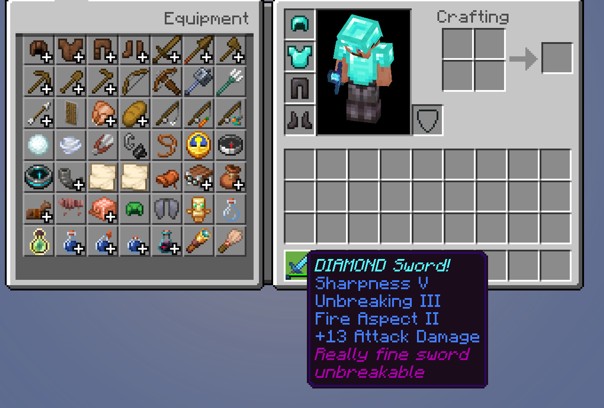
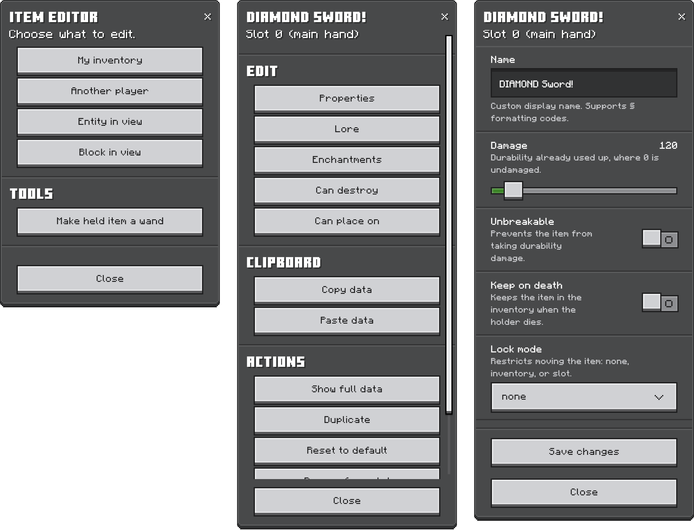

# Item Editor

An add-on for Minecraft Bedrock that edits items which already exist. Rename
them, write their lore, change enchantments, set durability, fill in a book,
retouch a sign, and hand the lot out as a kit.

No experimental toggles required.

<p align="center">
  
</p>

## Setup

1. Grab the latest `ItemEditor.mcpack` from
   [Releases](https://github.com/Justash01/item-editor/releases).
2. Apply the behavior pack to your world.
3. Activate cheats. You'll need operator.

Needs Minecraft Bedrock **1.26.40** or newer.

## Menus

```
/jstash:editor
```

Pick your own inventory, another player, or whatever you're looking at, then
pick an item. Name, lore, enchantments, durability and flags all live in there,
along with book pages, sign text and block states.



There's a Wand for easily reaching and editing entities and blocks directly, a clipboard for copying one
item's setup onto another, undo on every slot, and a bulk mode for doing all of
that to a whole set of armor at once. The
[editor guide](docs/editor.md) walks through it.

## Commands

Pick something once, then edit it as many times as you like:

```
/jstash:select @s head
/jstash:set name "Great helmet"
/jstash:ench protection 4
/jstash:set unbreakable true
```

Swap the slot for a group like `equipment` and every command after it covers
the whole set. There's also `/jstash:grant` for building an item in one line,
`/jstash:kit` for saving and handing out inventories, and `/jstash:block` for
block states. The [command reference](docs/commands.md) has all of them.

## What it can't do

- **Enchantment levels cannot go beyond vanilla maximum**, and enchantments that
  clash are refused. That's the game limitation.
- **Food, potion and cooldown values are read-only.** You can look at them and
  that's it.
- **Blocks only expose their states**, plus sign text and container contents.

## Building from source

Needs [Regolith](https://regolith-docs.readthedocs.io/en/latest/introduction/installation/) and Node.

```bash
regolith install-all
regolith run
```

## Credits

Made by [Justash01](https://github.com/Justash01). Discord: `jstash`.

Found a bug or want something added? Open an
[issue](https://github.com/Justash01/item-editor/issues).

Built with [Regolith](https://github.com/Bedrock-OSS/regolith) and the
[gametests filter](https://github.com/Bedrock-OSS/regolith-filters) from
Bedrock OSS.

Released under the [MIT license](LICENSE).
