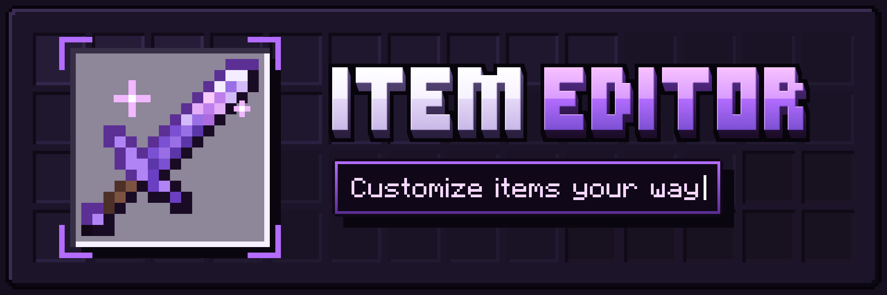
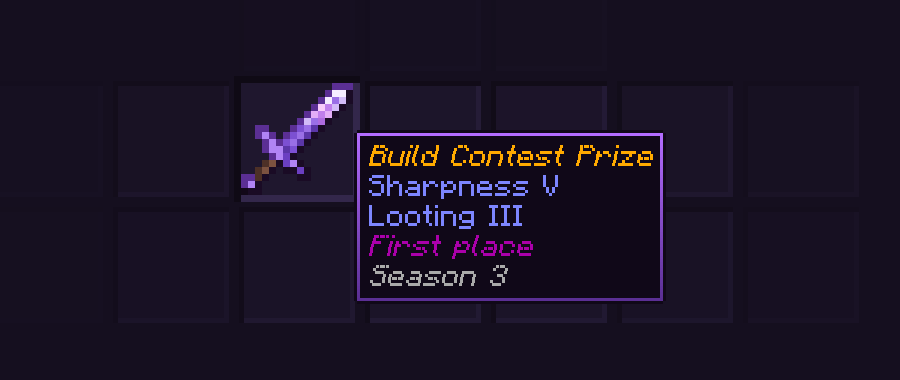

<p align="center">
  <a href="https://jstash.dev/item-editor">
    
  </a>
</p>

<p align="center">
  <a href="https://github.com/Justash01/item-editor/releases/latest"><b>Download</b></a>
  &nbsp;·&nbsp;
  <a href="https://jstash.dev/item-editor">Website</a>
  &nbsp;·&nbsp;
  <a href="https://jstash.dev/item-editor/docs">Docs</a>
  &nbsp;·&nbsp;
  <a href="https://jstash.dev/item-editor/builder">Item builder</a>
</p>

An add-on for Minecraft Bedrock that edits items which already exist. Rename
them, write their lore, change enchantments, set durability, fill in a book,
edit a sign, and save the lot as a kit and many more.

No experimental toggles required.

## Setup

1. Grab the latest `ItemEditor.mcpack` from
   [Releases](https://github.com/Justash01/item-editor/releases).
2. Apply the behavior pack to your world.
3. Activate cheats. You'll need operator.

Needs Minecraft Bedrock **1.26.40** or newer.

## Menus

```
/jstash:editor
```

Pick your own inventory, another player, or whatever you're looking at, then
pick an item. Name, lore, enchantments, durability and flags all live in there,
along with book pages, sign text and block states.


There's a Wand for easily reaching and editing entities and blocks directly, a clipboard for copying one
item's setup onto another, undo on every slot, and a bulk mode for doing all of
that to a whole set of armor at once. The
[editor guide](docs/editor.md) walks through it.

## Abilities

Items can also do things by themselves. A sword that calls lightning one hit in
five, boots that give night vision, a pickaxe that takes the whole ore vein and
drops the ingots in your pocket. Pick what sets it off, anything from a hit to
simply wearing the thing, then line up to eight steps behind it. There are 18
templates if you'd rather start from something that already works.

```
/jstash:editor @s mainhand abilities
```

The [abilities guide](docs/abilities.md) covers all of it.

## Commands

Pick something once, then edit it as many times as you like:

```
/jstash:select @s head
/jstash:set name "Staff Helmet"
/jstash:ench protection 4
/jstash:set unbreakable true
```

Swap the slot for a group like `equipment` and every command after it covers
the whole set. There's also `/jstash:grant` for building an item in one line,
`/jstash:kit` for saving and handing out inventories, and `/jstash:block` for
block states. The [command reference](docs/commands.md) has all of them.

<p align="center">
  
</p>

If you'd rather not write a `/jstash:grant` line by hand, the
[item builder](https://jstash.dev/item-editor/builder) on the website does it
for you. Pick any item, set it up, and copy the command.

## What it can't do

- **Enchantment levels cannot go beyond vanilla maximum**, and enchantments that
  clash are refused. That's the game limitation.
- **Food, potion and cooldown values are read-only.** You can look at them and
  that's it.
- **Blocks only expose their states**, plus sign text and container contents.

## Building from source

Needs [Regolith](https://regolith-docs.readthedocs.io/en/latest/introduction/installation/) and Node.

```bash
regolith install-all
regolith run
```

The docs in `docs/` are also what [jstash.dev](https://jstash.dev/item-editor/docs)
shows, it pulls them from `main` on every deploy. Links between guides should
stay plain relative ones, like this one to the
[properties table](docs/commands.md#properties), and they'll work in both places.

## Credits

Made by [Justash01](https://github.com/Justash01). Discord: `jstash`.

Found a bug or want something added? Open an
[issue](https://github.com/Justash01/item-editor/issues).

Built with [Regolith](https://github.com/Bedrock-OSS/regolith) and the
[gametests filter](https://github.com/Bedrock-OSS/regolith-filters) from
Bedrock OSS.

Released under the [MIT license](LICENSE).
