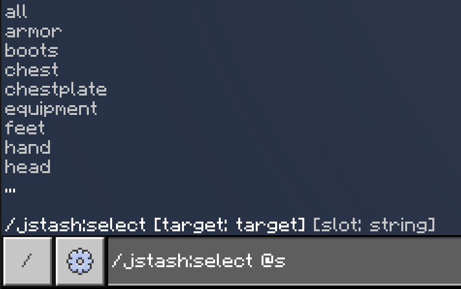
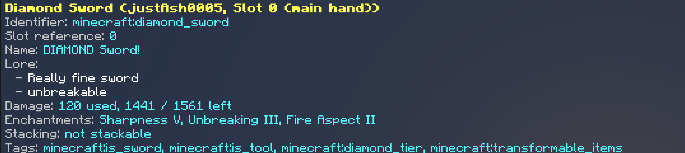
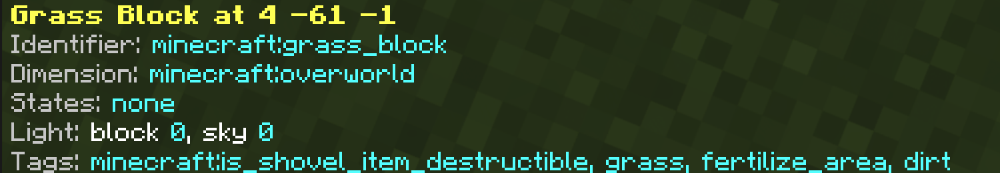

# Command reference

Arguments, behavior and edge cases. For the menus, see the
[editor guide](editor.md).

## Contents

**How it works**

- [Selections](#selections)
- [Groups](#groups)
- [Feedback](#feedback)
- [Undo](#undo)

**Commands**

- [`/jstash:select`](#jstashselect)
- [`/jstash:set`](#jstashset)
- [`/jstash:ench`](#jstashench)
- [`/jstash:lore`](#jstashlore)
- [`/jstash:item`](#jstashitem)
- [`/jstash:grant`](#jstashgrant)
- [`/jstash:kit`](#jstashkit)
- [`/jstash:block`](#jstashblock)
- [`/jstash:editor` and `/jstash:settings`](#jstasheditor-and-jstashsettings)

**Reference**

- [Properties](#properties)
- [Item data documents](#item-data-documents)
- [Slots](#slots)

## Selections

`set`, `ench`, `lore` and `item` don't take a target. They run against your
selection:

```
/jstash:select @p[name=Steve] head
/jstash:set name "Staff Helmet"
/jstash:ench minecraft:protection 4
```

Selections are per player and survive reloads. `grant`, `kit` and `block` take
their target directly instead.

The important part is that a selection points at a **slot**, not at an item.
Select `mainhand`, scroll to another hotbar slot, and the next command hits
whatever is there now. The same goes for a chest slot someone else empties
while you're working. If the entity unloads or dies, the next command says so
and asks you to pick again.

## Groups

Select a [group](#slot-groups) instead of a single slot and every editing
command covers all of it:

```
/jstash:select @s equipment
/jstash:ench all
/jstash:set unbreakable true
```

Empty slots are left out, and the group is resolved on each command, so gear
put on after selecting is included. Items a command doesn't suit are skipped
rather than failed: enchanting an `all` selection quietly steps over your food
and names it in the summary. You get one summary line, with a red line under it
for anything that genuinely failed, and one `undo` reverses the whole batch.

## Feedback

Green worked, red didn't, and the red lines say what was expected. Errors that
depend on the item, like enchanting a stick, arrive a moment after the command
rather than immediately.

The **Chat messages** [setting](editor.md#settings) turns these down to failures
only, or off entirely. Reports you asked for, like `item inspect` and
`item list`, print either way. So do the errors the game itself raises for a bad
argument, since those come from the command parser rather than from the add-on.

Item and block names follow the **Localized names**
[setting](editor.md#settings); with it off you get ids like
`minecraft:diamond_sword`.

Command blocks and functions can run `grant`, `block`, `kit list` and
`kit delete`, plus `kit save` and `kit give` with a target. Anything using a
selection, along with `editor` and `settings`, needs a player.

## Undo

```
/jstash:item undo
```

Takes back the most recent change to the selected slot or group. `set`,
`ench`, `lore`, `item apply`, `item paste` and the menus are all recorded;
failed commands, read-only ones and block edits aren't.

History belongs to the slot rather than to your selection, so you can select
something else, come back, and still walk it back. Each slot keeps its last 10
changes, or whatever **Undo steps** is set to, and the lot is gone when the
world closes.

A batch across several items comes back as one step. If you edited one of those
items on its own afterwards, that edit lifts off first, then the batch.

---

## `/jstash:select`

```
/jstash:select [target] [slot]
```

| Argument | |
| --- | --- |
| `target` | Optional. Any entity with an inventory or equipment. Defaults to you. |
| `slot` | Optional. A [slot](#slots) or a [group](#slot-groups). Defaults to `mainhand`. |

| You type | Result |
| --- | --- |
| `/jstash:select`, nothing selected yet | Your own main hand. |
| `/jstash:select`, something already selected | Reports the selection, changes nothing. |
| `/jstash:select <target>` | That target's main hand. |
| `/jstash:select <target> <slot>` | That slot. |
| `/jstash:select <target> <group>` | Every filled slot in the group. |

<p align="center">
  
</p>

```
/jstash:select @s offhand
/jstash:select Steve 12
/jstash:select @e[type=armor_stand,c=1] chest
/jstash:select @p equipment
```

Dropping the target only works if you drop the slot too, so use `@s` when you
want your own gear. A selector matching several entities takes the first and
tells you how many it ignored. Selecting a group nobody has anything in fails,
as does selecting a container block: read those with
[`/jstash:block contents`](#jstashblock) or edit them in the menus.

## `/jstash:set`

```
/jstash:set <property> [value]
```

Sets one [property](#properties), or resets it when you leave the value off.

```
/jstash:set name "§6Starter Sword"
/jstash:set damage 0
/jstash:set lore "First line | Second line"
/jstash:set enchantments "sharpness 5, unbreaking III"
/jstash:set candestroy "minecraft:stone, minecraft:dirt"

/jstash:set name
```

`lore` and `enchantments` replace the whole list, so reach for `/jstash:lore`
or `/jstash:ench` when you only want one entry changed.

Values arrive as text and nothing is checked until the command runs; the error
says what the property wanted. Properties that don't suit the item, like
`damage` on a stick, fail the same way, and across a [group](#groups) those
items are skipped instead.

## `/jstash:ench`

```
/jstash:ench <enchantment> [level]
```

| Argument | |
| --- | --- |
| `enchantment` | An enchantment id like `minecraft:sharpness`, or `all`. |
| `level` | Optional. Defaults to `1`. `0` removes it. |

Other enchantments on the item are left alone, and running it again on one
that's already there just changes the level.

```
/jstash:ench minecraft:sharpness 5
/jstash:ench minecraft:sharpness 0
```

Levels stop at the vanilla maximum and negatives are rejected. An enchantment
the item can't hold fails, and so does one that clashes with what's already on
it, so take the old one off first. Vanilla `/enchant` only reaches the held
item and can't remove anything; this works on any slot of any entity.

### `all`

| You type | Result |
| --- | --- |
| `/jstash:ench all` | Everything compatible, each at its highest level. |
| `/jstash:ench all 3` | Everything compatible at level 3, or lower where that's the maximum. |
| `/jstash:ench all 0` | Strips the lot. |


Where two enchantments can't sit together, whatever is already on the item
wins: a sword with Smite keeps Smite and doesn't get Sharpness. Failing that,
the usual favorite takes it. Sharpness over Smite and Bane of Arthropods,
Protection over the other protections, Mending over Infinity, Fortune over Silk
Touch, Density on a mace, Loyalty and Channeling over Riptide, Multishot over
Piercing, Depth Strider over Frost Walker. Curses are never added.

Items that can't be enchanted at all are skipped when a group is selected.

## `/jstash:lore`

```
/jstash:lore <operation> [value] [line]
```

| Operation | Syntax | Does |
| --- | --- | --- |
| `add` | `add "<text>"` | Adds a line at the end. |
| `set` | `set "<text>" <line>` | Replaces a line. |
| `insert` | `insert "<text>" <line>` | Slots a line in before that one. The current count adds at the end. |
| `remove` | `remove <line>` | Deletes a line. |
| `clear` | `clear` | Wipes the lot. |

Lines count from `0`, and `set` and `remove` need one that already exists, so
on a bare item start with `add`.

```
/jstash:lore add "§7Given on first join"
/jstash:lore insert "§6Event reward" 0
/jstash:lore remove 2
```

A line here can contain `|` and stays one line, unlike `/jstash:set lore`,
which splits on it.

## `/jstash:item`

```
/jstash:item <operation> [data]
```

| Operation | Changes the item | Does |
| --- | --- | --- |
| `list` | no | Lists every filled slot, with the reference each answers to. |
| `inspect` | no | Id, slot, every property off its default, and read-only detail like food values and cooldowns. |
| `export` | no | Prints the item as a [data document](#item-data-documents). |
| `apply` | yes | Applies a [data document](#item-data-documents). |
| `copy` | no | Copies the item's data to your clipboard. |
| `paste` | yes | Applies your clipboard to the item. |
| `duplicate` | adds an item | Drops a copy in the first free slot, and says what didn't fit. |
| `undo` | yes | See [undo](#undo). |

Across a [group](#groups), `inspect`, `export`, `apply`, `paste` and
`duplicate` run per item. `list` and `undo` treat the selection as one, and
`copy` wants a single item. There's no `clear` or `reset`, since vanilla
`/replaceitem` already does both.



### Exporting and applying

`export` prints only what differs from default, ready to paste into
`/jstash:item apply` or `/jstash:grant`:

```
{name:'Staff Helmet',enchantments:{'minecraft:protection':4},unbreakable:true}
```

```
/jstash:item apply "{name:'Spare Pickaxe',lore:['Keep in the chest'],damage:0}"
```

Only the fields in the document change, and every field is checked first, so
one bad field leaves the item untouched. With several items selected, each
exported document is prefixed with its slot.

### Copy and paste

The data moves, not the item: copy a sword onto an axe and the axe keeps being
an axe. Paste onto a group and one well-built sword kits out a whole hotbar.

```
/jstash:select @s 0
/jstash:item copy
/jstash:select @s hotbar
/jstash:item paste
```

Your clipboard is yours alone and survives reloads. `copy` fails if the
selection covers more than one item.

Pasting is all or nothing per item, same as `apply`. `damage` won't go onto
something without durability, and an enchantment that clashes with what an item
already has stops the paste for that item, which is why pasting a sword across
a mixed hotbar skips a few things and says so.

## `/jstash:grant`

```
/jstash:grant <target> <item> [amount] [data]
```

| Argument | |
| --- | --- |
| `target` | Who gets it. Everyone matched gets one. |
| `item` | Any item in the game. |
| `amount` | Optional. Defaults to `1`. |
| `data` | Optional. An [item data document](#item-data-documents). |

```
/jstash:grant @a minecraft:golden_apple 8
/jstash:grant @s minecraft:iron_sword 1 "{name:'§7Old Sword',damage:220,keepondeath:true}"
```

`data` needs `amount` in front of it even when it's `1`, and `amount` inside
the document wins over the argument. The document is checked before anything is
created, so a bad one means nobody gets anything. Whatever doesn't fit in a
full inventory is **not dropped**, just counted in the message.

## `/jstash:kit`

```
/jstash:kit <operation> [name] [target]
```

| Operation | Syntax | Does |
| --- | --- | --- |
| `save` | `save <name> [target]` | Saves everything the target is carrying. |
| `give` | `give <name> [target]` | Adds the kit to each target's inventory. |
| `list` | `list` | Shows the saved kits and how much each holds. |
| `delete` | `delete <name>` | Deletes a kit for good. |

Kits keep names, lore, enchantments and durability, hold 54 items at most, and
are stored on the world. `target` defaults to whoever ran the command.

```
/jstash:kit save arena_red @p[tag=red_captain]
/jstash:kit give starter @a
```

Names take up to 32 letters, digits, spaces, `-` and `_`. Capitals and extra
spaces make no difference, so `Red Team` and `red team` are the same kit, and
saving over an existing name replaces it without asking.

Two things catch people out. `save` with a selector matching several players
saves them one after another under the same name, so only the last one sticks;
save one player at a time. And `give` puts items wherever there's room, so
original slots aren't restored and saved armor arrives in the inventory rather
than worn.

## `/jstash:block`

```
/jstash:block <operation> <position> [state] [value]
```

| Operation | Does |
| --- | --- |
| `inspect` | Prints everything about the block. |
| `states` | Lists the block's states and their values. |
| `set` | Changes one state. Takes `state` and `value`. |
| `reset` | Puts every state back to default. |
| `contents` | Prints a full report for every item in a container block. |

`position` takes `~` and `^`, and has to be in a loaded chunk of the dimension
you ran the command from.

```
/jstash:block states ~ ~-1 ~
/jstash:block set ~ ~-1 ~ pillar_axis x
/jstash:block set ~ ~ ~1 open_bit true
/jstash:block contents 10 64 -20
```



Run `states` before `set`: the value has to match the type already in use,
whether that's `true`/`false`, a whole number or text. Changing one state
leaves the rest of the block alone, so a chest keeps its items.

Only block states are editable here. Sign text and container contents go
through the [editor](editor.md#blocks), and things like a spawner's mob or a
command block's command are out of reach entirely. Block edits can't be undone.

## `/jstash:editor` and `/jstash:settings`

```
/jstash:editor [player] [slot] [panel]
/jstash:settings
```

Both open menus and both need a player to run them. The
[editor guide](editor.md) covers what's in there, and the settings are listed
[at the end of it](editor.md#settings).

On its own `editor` opens the start screen, and naming a player skips straight
to their inventory. A [slot](#slots) after the player opens that item's menu,
and a panel after the slot opens just that one screen.

```
/jstash:editor @s
/jstash:editor @s head
/jstash:editor @s mainhand enchantments
/jstash:editor Steve offhand abilities
```

The panels are `item` (the item's own menu, same as leaving it out),
`properties`, `lore`, `enchantments`, `abilities`, `book`, `candestroy` and
`canplaceon`. If the item can't have the one you asked for, enchantments on a
stick say, the command tells you and nothing opens.

---

## Properties

The values `/jstash:set` changes, and the keys for an
[item data document](#item-data-documents).

| Property | Applies to | Command value | Document value | Default |
| --- | --- | --- | --- | --- |
| `name` | any item | any text, `§` codes allowed | `'text'` | no custom name |
| `amount` | stackable items | 1 to the stack limit | `16` | `1` |
| `lore` | any item | lines separated by `\|` | `['line','line']` | no lore |
| `damage` | items with durability | 0 to max durability | `100` | `0` |
| `unbreakable` | items with durability | `true` / `false` | `true` | `false` |
| `enchantments` | enchantable items | `"sharpness 5, unbreaking III"` | `{sharpness:5,unbreaking:3}` | none |
| `keepondeath` | any item | `true` / `false` | `true` | `false` |
| `lockmode` | any item | `none`, `inventory` or `slot` | `'slot'` | `none` |
| `candestroy` | any item | block ids, comma separated | `['minecraft:stone']` | none |
| `canplaceon` | any item | block ids, comma separated | `['minecraft:dirt']` | none |
| `abilities` | any item, stackables if [turned on](abilities.md#stackable-items) | a list of abilities | `[{trigger:'hit',action:'lightning'}]` | none |

Anything taking `true`/`false` also takes `yes`/`no`, `on`/`off` and `1`/`0`.

`damage` is durability used up rather than durability left, so `0` is a fresh
item; `inspect` shows both numbers. `lockmode` `inventory` stops the item
leaving the inventory and `slot` pins it to its slot as well. `candestroy` and
`canplaceon` only matter in Adventure mode, and every block id is checked.

`enchantments` is the fiddly one. Levels take numbers or Roman numerals, names
work with or without `minecraft:`, and spaces stand in for underscores, so
`fire aspect 2` is fine. The list replaces everything on the item, and each
entry is checked for level and clashes before any of it is written.

`lore` also takes `<b>` as a line break, left over from older versions.

`abilities` has enough to it that it gets its own section in the
[abilities guide](abilities.md#writing-them-by-hand). Like `lore` and
`enchantments`, the list replaces whatever the item had.

## Item data documents

Used by `/jstash:grant`, `/jstash:item apply` and `/jstash:item export`. Keys
are the [properties](#properties) above.

```
{name:'Event Sword',lore:['Build contest','§71st place'],enchantments:{fire_aspect:2},unbreakable:true}
```

It's JSON with a few rules relaxed so it survives being typed into chat. Keys
don't need quotes, strings can use single quotes so they don't collide with the
double quotes around the argument, and trailing commas are allowed. Ordinary
JSON works too if you'd rather escape everything.

Only the keys present are touched, so `{name:'X'}` renames the item and leaves
the rest of it alone. The whole document is checked before anything is written,
and an unknown key, a wrong type or a property the item can't have stops all of
it.

To clear a value, pass an empty one where the property allows it (`name:''`,
`lore:[]`), or use `/jstash:set <property>` with no value.

## Slots

| Reference | Also answers to | Slot |
| --- | --- | --- |
| `mainhand` | `hand`, `selected` | Whatever's held. For players, the active hotbar slot. |
| `offhand` | | Off hand |
| `head` | `helmet` | Helmet |
| `chest` | `chestplate` | Chestplate |
| `legs` | `leggings` | Leggings |
| `feet` | `boots` | Boots |
| `0` to `35` | | Inventory slot |

For players, `0` to `8` is the hotbar and `9` to `35` the rest. Other entities have
fewer, and an index past the end tells you the range. Equipment names only work
on entities that wear equipment.

### Slot groups

| Group | Covers |
| --- | --- |
| `armor` | Helmet, chestplate, leggings, boots |
| `equipment` | Armor plus both hands |
| `hotbar` | Slots `0` to `8` |
| `all` | Everything carried, armor and off hand included |

`armor` and `equipment` need an entity that wears equipment, `hotbar` one with
an inventory. See [groups](#groups) for how they behave once selected.
