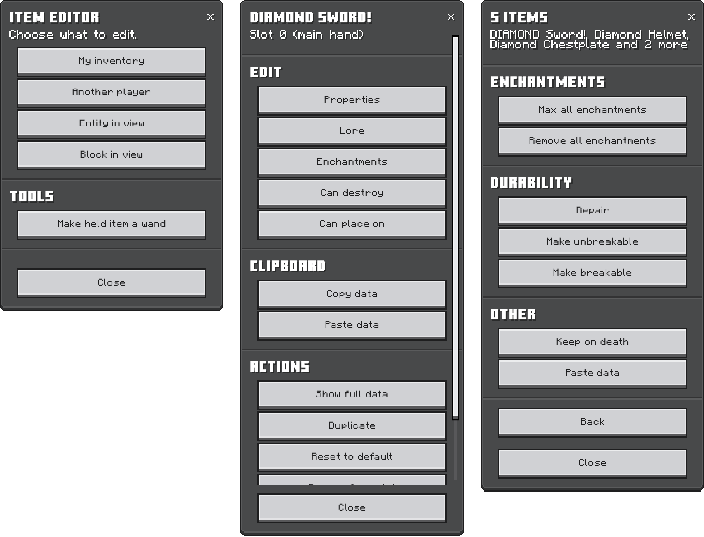
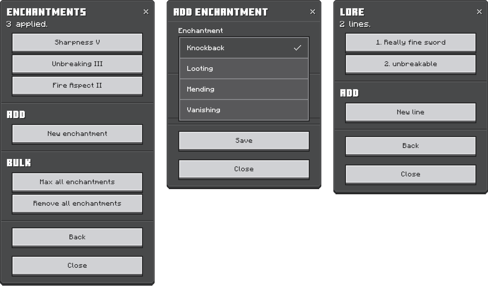
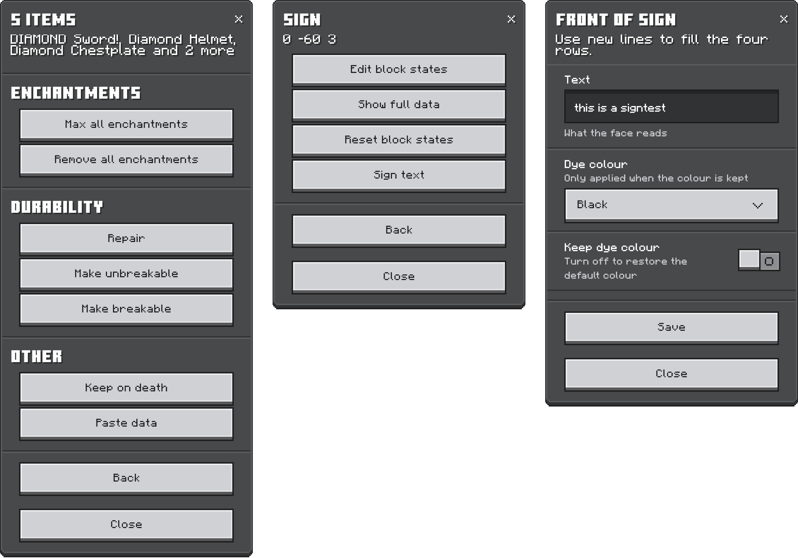

# Editor guide

Everything the menus do. For the command side, see the
[command reference](commands.md).

## Contents

- [Opening it](#opening-it)
- [Editing an item](#editing-an-item)
- [Blocks](#blocks)
- [Several items at once](#several-items-at-once)
- [Clipboard and undo](#clipboard-and-undo)
- [The wand](#the-wand)
- [Settings](#settings)

## Opening it

```
/jstash:editor [player] [slot] [panel]
```

The first menu picks what to work on: your own inventory, another player, the
entity you're looking at, or the block you're looking at. Naming a player skips
straight to their inventory, and a slot and panel after that skip the rest, so
`/jstash:editor @s mainhand enchantments` opens the enchantments for whatever
is in your hand. More in the
[command reference](commands.md#jstasheditor-and-jstashsettings).



**Back** goes up one screen, the **✕** leaves entirely however deep you are,
and looking at something reaches 12 blocks unless you change
[reach](#settings).

## Editing an item

Each item opens a hub with whatever applies to it.

| Screen | Covers |
| --- | --- |
| Properties | Name, stack size, durability, unbreakable, keep on death, lock mode |
| Lore | One screen per line, added, edited or removed |
| Enchantments | What's on the item, plus anything it can still take |
| Book | Pages, title and author, on writable and written books |
| Can destroy / Can place on | Adventure mode block lists |
| Abilities | What the item does when you hit, use, mine or wear it, covered in [its own guide](abilities.md) |



The enchantment list only offers what the item can actually take and the level
slider stops where that enchantment stops, so you can't build something the
game will refuse. **Max all enchantments** fills in everything compatible at
once, keeping what's already on the item wherever two enchantments clash, and
leaving curses out.

**Show full data** prints the same report as `/jstash:item inspect` to chat,
which is the only way to see the read-only parts: food values, potion effects,
cooldowns, tags and dynamic properties.

## Blocks

Looking at a block gets you its states, **Show full data**, and a reset.
Changing one state leaves the rest of the block alone, so a chest keeps its
items, but none of it can be undone.

Signs add a text editor per face with dye color and the wax, including taking
wax back off, which the game itself won't let you do. Chests, barrels and the
rest add **Edit items inside**, which drops you into the same item list as any
inventory.

## Several items at once

**Edit several at once** shows up in any inventory holding more than one item.
Pick a group, or tick items off by hand.



| Group | Covers |
| --- | --- |
| Armor | Helmet, chestplate, leggings, boots |
| Armor and hands | Armor plus both hands |
| Hotbar | Slots 0 to 8 |
| Everything | The lot, armor and off hand included |

From there: max or remove enchantments, repair, make things unbreakable or
breakable again, turn on keep on death, and paste copied data. Anything the
action doesn't suit is skipped and named afterwards, and the whole batch undoes
as one step.

## Clipboard and undo

**Copy data** remembers how an item is set up and **Paste data** drops that
onto another one. The data travels, not the item, so a sword's name, lore and
enchantments land on an axe and it stays an axe. Your clipboard is yours alone
and survives reloads.

**Undo last change** walks back the edits on that slot, ten deep to start with,
covering menu edits and commands alike. The history belongs to the slot rather
than to what you have selected, so you can wander off and come back to it. It's
gone when the world closes.

## The wand

Under **Tools**, "Make held item a wand" turns whatever you're holding into a
wand. Point it at a block or an entity and the editor opens on it, already
selected, so the commands line up with whatever you were just looking at. The
same entry turns it back.

Anything that doesn't stack works, and the marker rides along with the item,
so handing someone your wand hands them a wand. Stackable items have nowhere to
keep the marker.

The catch is that a wand takes over the item's normal use, which is fine on a
carrot on a stick and less fine on the pickaxe you were mining with. **Wand only while
sneaking** in the settings fixes that: sneak and it's a wand, don't and it's
just a pickaxe.

## Settings

```
/jstash:settings
```

Stored on the world, so they apply to everyone on it.

| Setting | Default | |
| --- | --- | --- |
| Chat messages | Everything | What the add-on reports in chat, from the menus and the commands alike: everything, failures only, or nothing. |
| Sounds | On | A sound when something works, another when it fails. |
| Localized names | On | Item and block names in your language. Off shows ids like `minecraft:diamond_sword`. |
| Roman enchantment levels | On | `Sharpness V` instead of `Sharpness 5`. |
| Confirm destructive actions | On | Ask before resets, deletes and enchantment strips. |
| Reach | 12 | How far **Entity in view** and **Block in view** reach, 4 to 64 blocks. |
| Undo steps | 10 | How many changes each slot remembers, 1 to 25. |
| Wand only while sneaking | Off | The wand waits until you sneak. |
| On stackable items | Off | Lets items that stack have [abilities](abilities.md#stackable-items), saved on the world. |
| Type any number | Off | Text boxes instead of sliders for ability numbers, so they can go past the usual range. |

Lowering **Undo steps** doesn't wipe history straight away; the oldest steps
drop off the next time that slot is edited. Enchantment and potion effect
names stay in English whatever **Localized names** says, since the game doesn't
expose translations for them.
